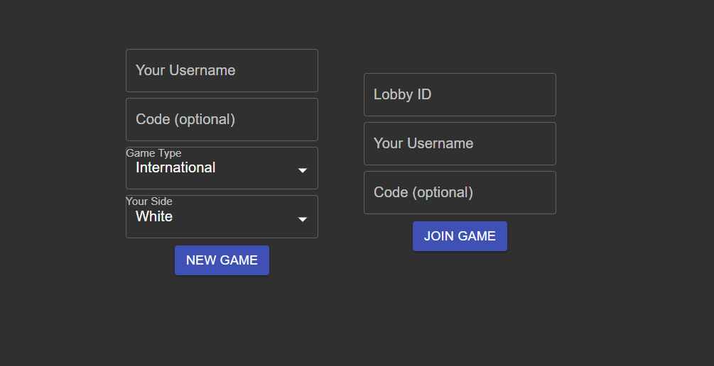

# Checkers Hackers
My first React.js + Node.js project. It's a multiplayer game of checkers with [some expandability options](#Expandability). You can either [run it yourself](#How-to-run-LAN) or visit the [hosted version](#Hosted-version).

Wondering there is the git history? It's gone due to data loss. I saved the source code though, so it's fine, I guess.

*Project's name was a suggestion by my friend and it stuck to the project. It's doesn't really mean anything, it just sounds good.*

## Description
### How to play
- moving pieces is done by dragging.
- to remove a piece from the board, drag it to the discard pile below the board.
- you can bring pieces back to the board as well (even if you haven't removed them, negative numbers are a feature).
- to crown / decrown a piece, double click it.
- moves are not checked, you can move any piece to any square at any time

### Game Types
- International Checkers: [page on wikipedia](https://en.wikipedia.org/wiki/International_draughts)
- Russian Checkers: [page on wikipedia](https://en.wikipedia.org/wiki/Russian_draughts)

## Versions
- v1.0.4b: fist public version. Includes all minimal functionality and a part of the expandability stuff.

## How does it work
### Project structure
- client: a fronted module written with React.js, some CSS and SVG. It's the biggest and the main part of the project.
- server: a backend module written with Node.js, express and ws for web sockets. It's used for synchronization only and isn't persistent at all. 

### Interaction
TBA

### Technologies
TBA

## Demonstration (screenshots)
#### Main menu (new game & join forms).

#### Lobby / waiting page.

#### In-game, starting position (international).

#### In-game, close to the end (russian)

## How to run (LAN)
TBD

## Hosted version
It's simple, just visit: https://checkers-hackers.herokuapp.com/. It should work... 

The project is hosted on [heroku](https://heroku.com). It's two separate apps: client and server, same as modules. *TBA: info / links on how to host such a thing*

#### Some stuff to note here:
- Users are rare, so when you visit it, you can expect some delay as you create a lobby of try to join one: as server-side will be starting on the first request.
- App doesn't have a public lobby system *yet*, so you can either invite your friends or open a couple of tabs with different perspectives.
- AD-blockers should **not** break the side. If they do, please submit an issue.

### Expandability
TBD
